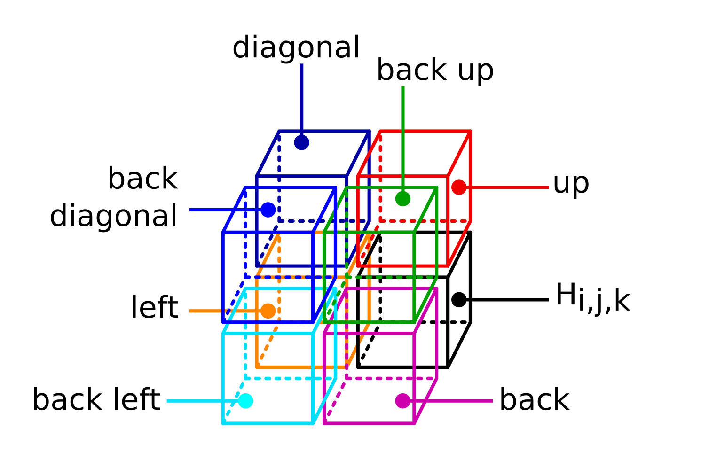
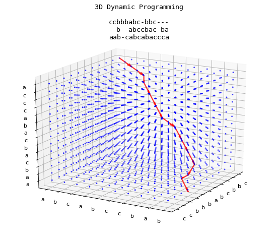

# Formulation and Implementation of Three String Alignment Using 3D Dynamic Programming

We want to extend the Needleman Wunsch algorithm  algorithm to three strings. Let ,  and  be the strings to be aligned, where n, m and l are A, B ad C lengths. gap is the penalty of opening a gap between two strings. We construct a substitution matrix which contains substitution scores, for example 1 matching -1 non matching. We call this matrix $s$. Tto hold the values for matching and non matching characters as follows (any value can be applied):

Let's now construct a scoring matrix H with size  and initialize its first row and, column and depth to decreasing numbers to find global alignment as per Needleman–Wunsch). Then, compute the scoring matrix as follows:

**Cells nomenclature**

 

**Example**

